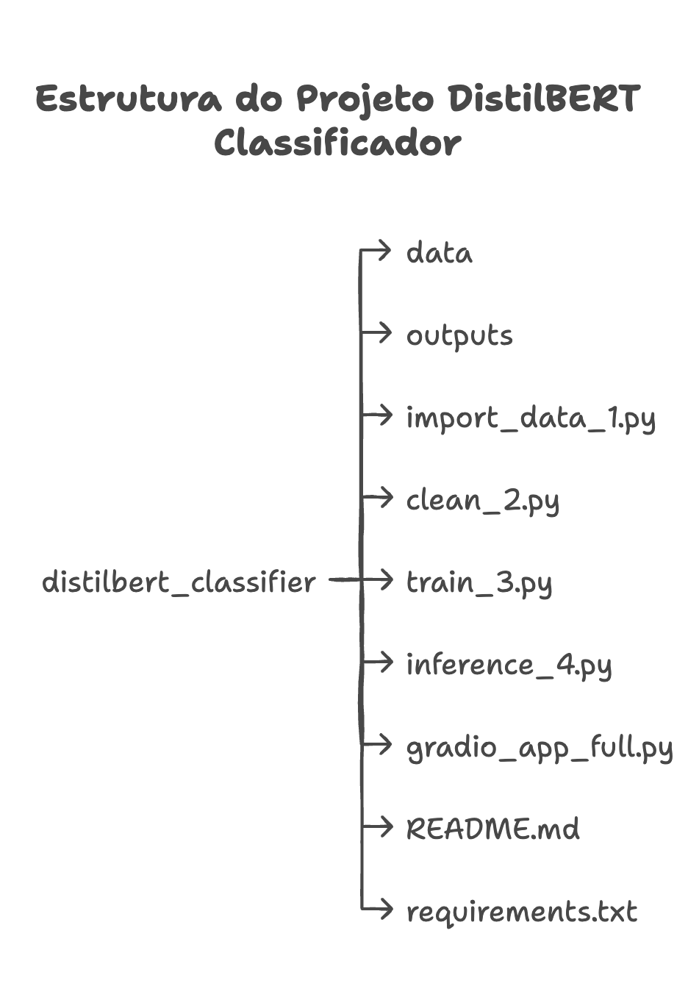

# 💻  Projeto: Classificador de Histórico utilizando DistilBERT

Este projeto tem como objetivo criar um pipeline para classificar textos (por exemplo, históricos de ocorrências policiais) utilizando **DistilBERT** para geração de embeddings, seguido de um classificador supervisionado (ex.: Logistic Regression). O pipeline inclui etapas para importar e acumular dados, realizar pré-processamento, treinar o modelo e fazer inferências. Além disso, há uma interface gráfica com **Gradio** que integra as funções de importação, treinamento, inferência e verificação/correção dos registros.

> **Observação:**  
> As correções de natureza são salvas diretamente no arquivo de dados processados (`dados_tratados.xlsx`), permitindo que o dataset seja acumulado e atualizado para novos treinamentos.


## Estrutura de Pastas

<p align="center">
  
</p>

```
distilbert_classifier/ 

├── data/ # Arquivos de entrada (por exemplo, naturezas.csv e arquivos Excel/CSV com dados brutos) 

├── outputs/ # Arquivos gerados: dados processados, modelo treinado, status, etc. 

├── import_data_1.py # Script para importar e processar os dados (acumula os dados em dados_tratados.xlsx) 

├── clean_2.py # Módulo com funções de limpeza de texto (limpar_texto e tratar_natureza) 

├── train_3.py # Script para treinar o classificador utilizando DistilBERT (gera embeddings e salva modelo) 

├── inference_4.py # Script para testar inferências em novos textos 

├── gradio_app_full.py # Interface gráfica integrada com Gradio (importação, treinamento, inferência e verificação) 

├── README.md # Documentação do projeto (este arquivo) 

└── requirements.txt # Lista de dependências
```

## 💻  Passo a Passo do Projeto

### 1. Importação e Processamento de Dados

Nesta etapa, os dados brutos (em Excel ou CSV) com as colunas `historico` e `natureza` são:
- **Importados** usando a interface Gradio (via `import_data_1.py`).
- **Filtrados** para remover linhas vazias.
- **Pré-processados**:
  - **Limpeza do Histórico:**  
    Converte para minúsculas, remove acentuação, caracteres especiais, a expressão `"como:"` (e outras, se necessário) e elimina espaços extras. O resultado é salvo em `historico_limpo`.
  - **Tratamento da Natureza:**  
    Converte para minúsculas, remove acentuação e substitui espaços por underscores para padronização (ex.: `"Roubo a Transeunte"` se torna `"roubo_a_transeunte"`), salvo em `natureza_tratada`.
- **Acúmulo de Dados:**  
  Se já existir um arquivo com dados processados (`dados_tratados.xlsx`), os novos registros são concatenados aos já existentes, evitando duplicatas com base no campo `historico_limpo`.
- **Geração de IDs:**  
  Se os registros não tiverem uma coluna `id`, ela é criada automaticamente com valores únicos (UUID) para identificar cada linha.

### 2. Treinamento do Modelo com DistilBERT

No script `train_3.py`:
- O arquivo `dados_tratados.xlsx` é carregado.
- São gerados embeddings para cada histórico em batches (com uma barra de progresso exibida no terminal via `tqdm`).
- Um classificador (Logistic Regression com `max_iter=3000`) é treinado com esses embeddings.
- O modelo treinado é salvo em `outputs/modelo_distilbert.pkl` e o status (acurácia) é atualizado em `outputs/status_distilbert.json`.

### 3. Inferência

No script `inference_4.py`:
- O modelo treinado e o tokenizer do DistilBERT são carregados.
- Um novo histórico é processado (utilizando a mesma função de limpeza).
- O embedding do histórico é gerado e passado ao classificador para prever a natureza.
- O resultado é exibido, permitindo que o usuário verifique se a previsão está correta.

### 4. Verificação e Correção dos Registros

Na interface integrada (`gradio_app_full.py`):
- Existe uma aba "Verificar Históricos" que:
  - Permite **filtrar** os registros do arquivo `dados_tratados.xlsx` por natureza (utilizando um dropdown que lê os valores do arquivo `naturezas.csv`).
  - Exibe os registros em uma tabela HTML com scroll vertical (o scroll horizontal é removido) e quebra de linha automática para o campo de histórico.
  - Permite ao usuário copiar manualmente o ID e inserir uma correção no campo "Nova Natureza". Essa alteração é salva diretamente no arquivo `dados_tratados.xlsx`, atualizando o registro.
  - Permite ao usuário cadastrar novas naturezas, atualizando a lista de opções automaticamente.

### 5. Interface Gradio

O arquivo `gradio_app_full.py` integra todas as funcionalidades em abas:
- **Importar Dados:** Permite carregar e processar novos arquivos.
- **Treinar Modelo:** Executa o treinamento usando os dados acumulados.
- **Inferência:** Permite testar a previsão de novos históricos e corrigir se necessário.
- **Verificar Históricos:** Facilita a consulta, verificação e correção dos registros existentes.

## 🚀 Tecnologias e Requisitos

- **Python 3.12.9** (ou superior)
- **Dependências:**
  - `pandas`
  - `numpy`
  - `torch`
  - `transformers`
  - `scikit-learn`
  - `openpyxl`
  - `gradio`
  - `tqdm`
  - (Outras conforme necessário)

## 🛠️ Instalação e como usar

1. **Clone** este repositório:
```bash
git clone <URL_do_repositório>
cd distilbert_classifier
```

2. **Crie e ative** um ambiente virtual (recomendado):
```bash
conda create --name distilbert_classifier python=3.12
conda activate distilbert_classifier
```
ou usando venv:

```bash
python3 -m venv env
source env/bin/activate
```

3. **Instale as dependências:**

. Individualmente:
```bash
pip install pandas numpy torch transformers scikit-learn openpyxl gradio tqdm
```

. Ou, se disponível, usando um arquivo requirements.txt
```bash
pip install -r requirements.txt
```

4. **Importe e processe os dados:**

Execute:
```bash
python import_data_1.py
```
A interface Gradio será iniciada. Faça o upload de um arquivo Excel ou CSV com as colunas historico e natureza.
Os dados serão processados, tratados e acumulados em outputs/dados_tratados.xlsx, e uma pré-visualização será exibida.

5. **Treine o Modelo:**

Execute:
```bash
python train_3.py
```
O modelo será treinado utilizando DistilBERT para gerar embeddings, e os arquivos resultantes (modelo e status) serão salvos em outputs/.

6. **Realize Inferências:**

Execute:
```bash
python inference_4.py
```
Insira um novo histórico e veja a natureza prevista.

7. **Utilize a Interface Gradio Integrada:**

Execute:
```bash
python gradio_app_full.py
```
A interface exibirá quatro abas: Importar Dados, Treinar Modelo, Inferência e Verificar Históricos.
Use essas abas para importar novos dados, treinar o modelo, fazer inferências e verificar/corrigir registros conforme necessário.
O link público pode ser criado usando share=True no launch().

## Exemplos de Dados

**Histórico:**

- Entrada: "Como: AO SAIR DA PRACA DA MACAXEIRA, FUI PARA..."
- Saída (em historico_limpo): "ao sair da praca da macaxeira fui para..."

**Natureza:**
- Entrada: "Roubo a Transeunte"
- Saída (em natureza_tratada): "roubo_a_transeunte"

**Linhas Vazias:**

São descartadas, garantindo que apenas registros completos sejam processados.
Considerações Finais

Este projeto integra um pipeline completo de classificação de textos usando DistilBERT e Logistic Regression, com interface Gradio para facilitar a interação e a manutenção dos dados.

As correções realizadas durante a inferência são salvas diretamente no arquivo de dados (dados_tratados.xlsx), permitindo re-treinamentos incrementais.

Futuramente, pode-se explorar abordagens híbridas (como clustering ou utilização de LLMs) para melhorar ainda mais a acurácia do sistema.

## 🪪 Licença

Esse projeto está sob a licença MIT.

---

Feito com :coffee: por [BrunnoML](https://www.brunnoml.com.br)